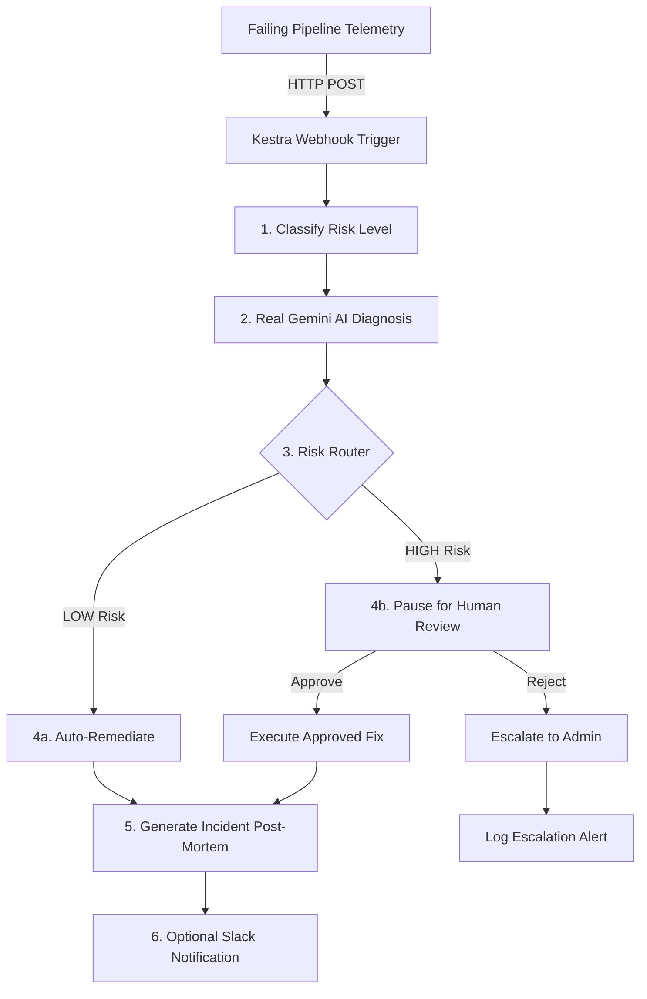

# 🛡️ Kestra Aegis

> *"Your data pipelines heal themselves."*

**Kestra Aegis** is an automated self-healing orchestrator that detects data pipeline failures, classifies risk, diagnoses the root cause using Gemini 2.5 Flash, and safely executes auto-remediations or manages human-in-the-loop approvals.

Built entirely using **Kestra**, **DuckDB**, and the **Gemini API (Structured Outputs)**, Aegis closes the gap between *detecting* pipeline failures (which tools like Monte Carlo or Bigeye do) and *resolving* them (which usually costs hours of data engineering time).

---

## 🌟 The Problem & The Vision

When production data pipelines break, they stay broken until a human engineer:
1. Wakes up to a Slack alert.
2. Manually queries the database to inspect the bad state.
3. Formulates a fix (e.g. SQL migration or data update).
4. Coordinates and executes the remediation.

According to industry benchmarks, this manual loop takes an average of **13-15 hours** per incident and costs enterprise teams thousands of dollars in lost productivity and stale dashboards.

**Kestra Aegis** automates the entire loop in seconds:
*   **Intercept**: External pipelines POST failure telemetry to a secure Kestra webhook.
*   **Classify**: Risk assessment rules evaluate the severity (LOW risk vs HIGH risk).
*   **Diagnose**: Gemini 2.5 Flash reviews database schemas, error traces, and sample rows to generate exact, executable SQL fixes via a strict JSON schema.
*   **Execute**: Aegis runs the fix inside containerized script runner environments with built-in retry policies.
*   **Protect**: Interactive manual approval gates block destructive/structural actions, and an active safety engine catches unauthorized queries (like `DROP`, `DELETE`, `TRUNCATE`).
*   **Document**: Comprehensive post-mortems are generated and logged.

---

## 🏗️ Technical Architecture

Aegis handles failures dynamically based on the assessed risk level:



---

## 🚀 Quick Start

Get Kestra Aegis running locally in 3 simple steps:

### 1. Clone the Repository
```bash
git clone https://github.com/deemanth05/KESTRA-AEGIS.git
cd KESTRA-AEGIS
```

### 2. Set Up Environment Variables
Copy the configuration template and insert your Gemini API Key from Google AI Studio:
```bash
cp .env.example .env
# Edit .env and set GEMINI_API_KEY=your-gemini-key
```

### 3. Launch Kestra
Start Kestra and PostgreSQL in the background:
```bash
docker compose up -d
```
Once healthy, access Kestra at **[http://localhost:8080](http://localhost:8080)** and log in using the credentials:
*   **Username**: `admin@kestra.io`
*   **Password**: `Admin1234!`

---

## 💻 Running the Demo Scenarios

Aegis is loaded with 3 pre-built failure simulation scenarios. To run them:

### Step A: Initialize the Demo Database
In Kestra, locate and execute the `setup_database` flow. This creates a DuckDB table `orders` inside `/tmp/kestra-wd/pipeline.duckdb` and loads 15 clean transactional rows.

### Step B: Trigger Failure Simulations

#### Scenario 1: `TYPE_MISMATCH` (LOW Risk - Auto-Remediates)
*   **Simulation**: Inject a text value (`'not_a_number'`) into a `DECIMAL` column.
*   **Aegis Action**: Gemini diagnoses the type clash and suggests inserting the row with a `NULL` amount. Aegis automatically executes the SQL.
*   **To Run**: Trigger `failure_simulator` in Kestra with input `failure_type=TYPE_MISMATCH`.

#### Scenario 2: `NULL_VIOLATION` (LOW Risk - Auto-Remediates)
*   **Simulation**: Inject `NULL` values into a non-nullable column.
*   **Aegis Action**: Gemini suggests updating all NULL fields to a default value (`0.00`) to preserve data quality. Aegis automatically executes the SQL.
*   **To Run**: Trigger `failure_simulator` with input `failure_type=NULL_VIOLATION`.

#### Scenario 3: `SCHEMA_DRIFT` (HIGH Risk - Manual Approval Gate)
*   **Simulation**: Ingestion source contains an extra column (`discount_code`) not yet present in the target database schema.
*   **Aegis Action**: Flow classifies it as `HIGH` risk and **pauses**. In the Kestra UI, review Gemini's proposed fix (`ALTER TABLE orders ADD COLUMN discount_code VARCHAR;`), select **Approve**, and click **Resume**.
*   **To Run**: Trigger `failure_simulator` with input `failure_type=SCHEMA_DRIFT`.

---

## 🛠️ Tech Stack & Dependencies

*   **Orchestrator**: [Kestra](https://kestra.io) (Standalone Server, Webhook Triggers, Flow Control, Pause/Resume).
*   **AI Engine**: [Google Gemini 2.5 Flash](https://aistudio.google.com) (Real AI diagnosis using structured JSON Outputs).
*   **Database**: [DuckDB](https://duckdb.org) (Fast, file-based database mounted locally inside docker containers).
*   **Docker**: Encapsulates Kestra environment and runs isolated python execution containers.

---

## 🛡️ Active Safety & Validation Engine

Aegis prioritizes database safety. The remediation engine (`scripts/remediate.py`) executes inside isolated Docker runners and runs static analysis on all SQL fixes:
*   **Banned Keywords**: Any SQL statements containing `DROP`, `DELETE`, or `TRUNCATE` are instantly blocked.
*   **Graceful Fallbacks**: If the Gemini API experiences network demand limits (HTTP 503) or JSON parsing fails, Aegis routes the exception to a high-risk manual review queue instead of failing the pipeline.
*   **Transactional Integrity**: Retries with exponential backoffs are configured for all database operations to handle locking during write operations.

---

## 🏆 Kestra Features Showcased

This project leverages the full power of Kestra:
*   **Webhook Triggers**: Unauthenticated public endpoints created to receive data pipeline exceptions.
*   **Pebble Templates & Coalescing**: Uses advanced Pebble logic (`??`) to handle variable resolution across dynamic execution branches.
*   **Pause & Resume**: Employs human-in-the-loop interactive forms within Kestra's UI for structural adjustments.
*   **Docker Task Runner**: Launches isolated, ephemeral container runtimes for python scripts, compiling dependencies (`duckdb`, `google-genai`) dynamically.
*   **Error Event Handling**: Intercepts overall pipeline exceptions using global `errors` blocks to alert administrators.

---

## 📄 License
This project is open-source and available under the [MIT License](LICENSE).
