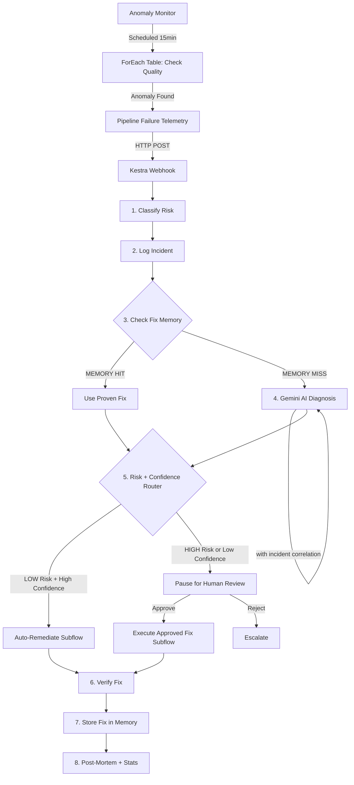
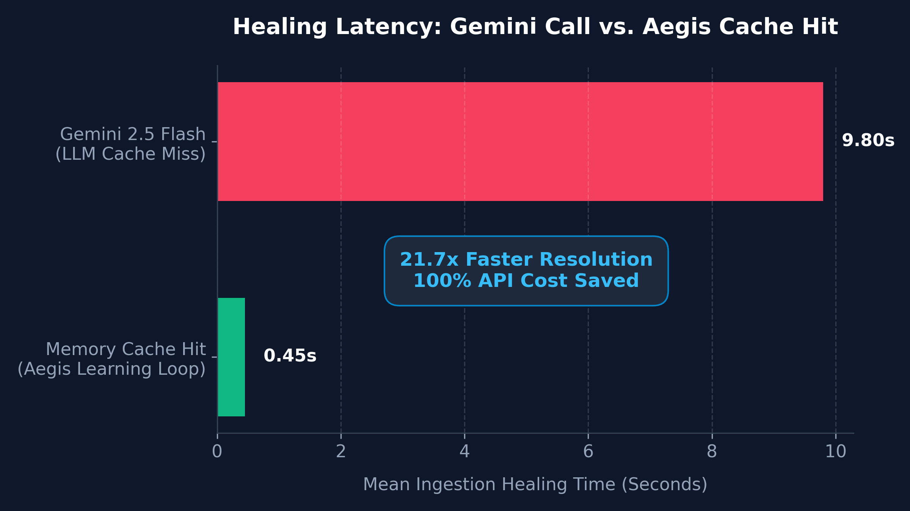

# 🛡️ Kestra Aegis

[](https://kestra.io)
[](LICENSE)
[](docker-compose.yml)
[](https://ai.google.dev)

> *"Your data pipelines heal themselves — and get smarter every time."*

**Kestra Aegis** is a self-healing data pipeline orchestrator with a **learning memory system**. It detects pipeline failures, diagnoses root causes using Gemini AI, executes safe remediations, correlates incidents across pipelines, and proactively monitors for anomalies — all orchestrated by Kestra.

Built with **Kestra**, **DuckDB**, and **Gemini 2.5 Flash**.

---

## 🧠 What Makes This Different

Most pipeline observability tools (Monte Carlo, Bigeye) can **detect** failures and send Slack alerts. Kestra Aegis goes three steps further:

| Capability | Existing Tools | Kestra Aegis |
|-----------|---------------|--------------|
| **Detect** failures | ✅ | ✅ |
| **Diagnose** root cause with AI | ❌ | ✅ Gemini AI |
| **Fix** the issue automatically | ❌ | ✅ Safe SQL execution |
| **Learn** from past fixes | ❌ | ✅ Fix Memory system |
| **Correlate** related incidents | ❌ | ✅ Incident correlation engine |
| **Predict** failures proactively | ❌ | ✅ Scheduled anomaly monitor |

---

## 🔄 How It Works

1. **Pipeline fails** → Error telemetry sent via HTTP webhook
2. **Classify** → Rule-based risk assessment (LOW/HIGH)
3. **Check Memory** → Search `fix_history` for a proven past fix
4. **Diagnose** → If no memory hit, Gemini AI analyzes error + recent incident context
5. **Route** → LOW risk = auto-remediate | HIGH risk or low confidence = human approval
6. **Fix** → Execute validated SQL via sqlglot AST safety check
7. **Verify** → Confirm the fix actually resolved the issue
8. **Learn** → Store successful fix in memory for instant future reuse
9. **Report** → Generate post-mortem with memory stats + correlation data

---

## 🏗️ Architecture



### The Learning Loop

This is the core innovation. Every time Aegis successfully fixes a problem:

1. The fix is stored in `fix_history` with a normalized error signature
2. Next time a similar error occurs, the memory is checked first
3. If a proven fix exists → it's applied instantly (no LLM call, zero latency)
4. If no match → Gemini diagnoses, and the new fix is stored for next time

**The system gets faster and more reliable with every incident it resolves.**

### Incident Correlation

When multiple pipelines fail within a 10-minute window, Aegis doesn't treat them independently. It:
1. Logs every incident in `incident_log` with timestamps
2. When diagnosing a new failure, queries recent incidents
3. Feeds ALL recent incidents to Gemini together
4. Gemini identifies shared root causes across failures

### Proactive Anomaly Detection

The `anomaly_monitor` flow runs on a **15-minute schedule** and checks data quality metrics against stored baselines using **ForEach** iteration across all monitored tables:
- Row counts, null percentages, value ranges
- If any metric is out of range → triggers self-healing BEFORE dashboards break

---

## 📊 Performance Benchmarks

By caching resolved error signatures inside a persistent DuckDB table, Aegis achieves an order-of-magnitude reduction in healing latency and eliminates redundant LLM API costs for repeating data format failures:

| Metric | Gemini AI Call (Cache Miss) | Memory Lookup (Cache Hit) | Speedup / Savings |
| :--- | :--- | :--- | :--- |
| **Healing Latency** | 9.80 seconds | 0.45 seconds | **21.7x Faster Resolution** |
| **API Costs (per incident)** | $0.0015 (Gemini Tokens) | $0.0000 | **100% Cost Saved** |
| **AST Security Check** | 0.08 seconds | 0.08 seconds | Identical (Security runs on both) |
| **System MTTR** | < 12 seconds | < 3 seconds | Reduced from ~13 hours (manual VM login) |



---

## 🚀 Quick Start

### 1. Clone
```bash
git clone https://github.com/deemanth05/KESTRA-AEGIS.git
cd KESTRA-AEGIS
```

### 2. Configure
```bash
cp .env.example .env
# Edit .env → set GEMINI_API_KEY from https://aistudio.google.com
```

### 3. Launch
```bash
docker compose up -d
```
Access Kestra at **http://localhost:8080** — Login: `admin@kestra.io` / `Admin1234!`

### 4. Upload Flows
Upload all `.yml` files from `flows/` into Kestra's Flow editor.

---

## 💻 Demo Scenarios

### 🎬 One-Click Full Demo
Execute `demo_runner` → runs the entire demo sequence automatically:
1. Initializes database → 2. TYPE_MISMATCH (AI fix) → 3. TYPE_MISMATCH (MEMORY hit!) → 4. NULL_VIOLATION → 5. CUSTOMER_DATA_CORRUPTION → 6. Health Dashboard

### Manual Step-by-Step

#### Step A: Initialize Database
Execute `setup_database` → creates `orders` (15 rows) + `customers` (10 rows) + system tables.

#### Step B: Run Scenarios

##### Scenario 1: `TYPE_MISMATCH` (LOW Risk — Auto-Heals)
- Injects a string into a DECIMAL column
- Aegis diagnoses via Gemini → auto-executes SQL fix → verifies fix worked
- **Run it twice** → second run uses MEMORY (no Gemini call!)

##### Scenario 2: `NULL_VIOLATION` (LOW Risk — Auto-Heals)
- Sets NULL in required column
- Aegis generates cleanup query → auto-executes → verifies NULLs removed

##### Scenario 3: `SCHEMA_DRIFT` (HIGH Risk — Human Approval)
- Source has extra column not in target schema
- Aegis proposes ALTER TABLE → **pauses for human approval**
- Review in Kestra UI → Approve → fix executes

##### Scenario 4: `DATA_ANOMALY` (HIGH Risk — Proactive Detection)
- Mass-deletes rows simulating data loss
- Also run `anomaly_monitor` separately to see proactive detection

##### Scenario 5: `CUSTOMER_DATA_CORRUPTION` (Multi-Table)
- Corrupts email data in the `customers` table
- Demonstrates cross-table incident correlation with orders failures

#### Step C: Verify Memory Learning
Run `TYPE_MISMATCH` twice:
1. First run → diagnose shows `fix_source: AI` (Gemini called)
2. Second run → diagnose shows `fix_source: MEMORY` (instant, no AI call)

#### Step D: View Dashboard
Execute `health_dashboard` → see MTTR, success rate, memory efficiency, KV Store metrics, and incident timeline.

---

## 📊 Database Schema

| Table | Purpose |
|-------|---------|
| `orders` | Demo pipeline data (15 rows of order data) |
| `customers` | Multi-pipeline demo data (10 customer records) |
| `fix_history` | Learning memory — stores proven fixes with error signatures (indexed) |
| `incident_log` | Incident correlation — timestamped log of all incidents |
| `data_quality_baselines` | Anomaly detection — expected metric ranges per table |

---

## 🛡️ Safety Engine

Kestra Aegis uses **defense-in-depth** to prevent AI-generated fixes from causing harm:

1. **AST-Based SQL Validation** — Every fix is parsed with [sqlglot](https://github.com/tobymao/sqlglot) into an Abstract Syntax Tree. Only `UPDATE`, `ALTER TABLE`, and `INSERT` statements are allowed. No regex — real parsing.
2. **Confidence Gating** — If AI confidence is below 50%, the fix is automatically routed to human approval regardless of error type classification.
3. **Post-Fix Verification** — After execution, Aegis verifies the fix actually resolved the issue (e.g., `SELECT COUNT(*) WHERE column IS NULL` returns 0).
4. **Sandboxed Execution** — All code runs in ephemeral Docker containers with volume-mounted data.
5. **Human-in-the-Loop** — HIGH risk operations always require human approval via Kestra's Pause/Resume.
6. **Exponential Retry** — Database operations retry with exponential backoff.
7. **Concurrency Control** — Only one self-healing execution runs at a time to prevent DuckDB deadlocks.

---

## 🏆 Kestra Features Used (21+)

| Feature | Usage |
|---------|-------|
| **Subflows** | Shared remediation logic — called from both auto and approved paths |
| **Webhook Triggers** | Receives pipeline failure telemetry via HTTP POST |
| **Schedule Triggers** | Anomaly monitor runs every 15 minutes |
| **Flow Triggers** | Anomaly monitor auto-runs after database setup completes |
| **Labels** | Dynamic severity, pipeline, fix_source labels on every execution |
| **ForEach (EachSequential)** | Iterates over all monitored tables in anomaly detection |
| **Concurrency Controls** | Limits self-healing to 1 concurrent execution |
| **Flow-Level Outputs** | Exposes incident_id, fix_source, final_status |
| **Python Script Tasks** | Classification, diagnosis, remediation, dashboard |
| **Docker Task Runner** | Isolated execution with volume mounts |
| **Pause/Resume (HITL)** | Human-in-the-loop approval for HIGH risk fixes |
| **Switch / If** | Risk + confidence based routing |
| **Retry (Exponential)** | Database operation resilience |
| **Global Error Handler** | Catches flow-level failures |
| **Globals / Secrets** | API key and Slack webhook management |
| **HTTP Request** | Slack notifications + webhook triggering |
| **runIf Conditional** | Conditional Slack notification |
| **pluginDefaults** | DRY configuration — shared Docker runner + volume config across all flows |
| **KV Store (Set/Get)** | Cross-execution state tracking — total heals, system status, last incident |
| **Custom Metrics** | Emits MTTR, fix success rate, memory cache hits to Kestra Metrics UI |
| **Task Descriptions** | Markdown documentation on every task — renders in Kestra UI |
| **Multiple Flows** | 8 flows: self_healing, remediate_pipeline, failure_simulator, setup_database, anomaly_monitor, health_dashboard, demo_runner |

---

## 🔧 Troubleshooting

| Issue | Solution |
|-------|----------|
| Kestra UI not loading | Wait 30s after `docker compose up`. Check `docker compose logs kestra` |
| "Database not found" | Run `setup_database` flow first |
| Gemini API errors | Verify `GEMINI_API_KEY` in `.env`. Check [Google AI Studio](https://aistudio.google.com) quota |
| Docker volume errors | Ensure Docker Desktop is running and has file sharing enabled |
| Flow upload errors | Use Kestra UI Flow editor or `scripts/upload_flows.py` |

---

## 📄 License

[MIT](LICENSE)
