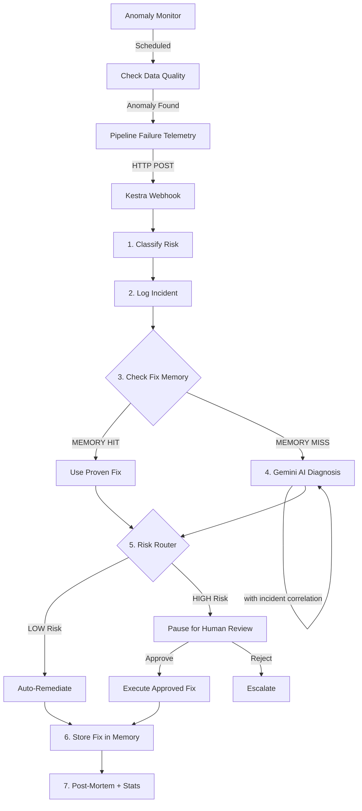

# 🛡️ Kestra Aegis

> *"Your data pipelines heal themselves — and get smarter every time."*

**Kestra Aegis** is a self-healing data pipeline orchestrator with a **learning memory system**. It detects pipeline failures, diagnoses root causes using Gemini AI, executes safe remediations, correlates incidents across pipelines, and proactively monitors for anomalies — all orchestrated by Kestra.

Built with **Kestra**, **DuckDB**, and **Gemini 2.5 Flash**.

---

## 🧠 What Makes This Different

Most pipeline observability tools (Monte Carlo, Bigeye) can **detect** failures and send Slack alerts. Kestra Aegis goes three steps further:

| Capability | Existing Tools | Kestra Aegis |
|-----------|---------------|--------------|
| **Detect** failures | ✅ | ✅ |
| **Diagnose** root cause with AI | ❌ | ✅ Gemini AI |
| **Fix** the issue automatically | ❌ | ✅ Safe SQL/Python execution |
| **Learn** from past fixes | ❌ | ✅ Fix Memory system |
| **Correlate** related incidents | ❌ | ✅ Incident correlation engine |
| **Predict** failures proactively | ❌ | ✅ Anomaly monitor |

---

## 🏗️ Architecture



### The Learning Loop

This is the core innovation. Every time Aegis successfully fixes a problem:

1. The fix is stored in `fix_history` with an error signature
2. Next time a similar error occurs, the memory is checked first
3. If a proven fix exists → it's applied instantly (no LLM call, zero latency, guaranteed to work)
4. If no match → Gemini diagnoses, and the new fix is stored for next time

**The system gets faster and more reliable with every incident it resolves.**

### Incident Correlation

When multiple pipelines fail within a 10-minute window, Aegis doesn't treat them independently. It:
1. Logs every incident in `incident_log` with timestamps
2. When diagnosing a new failure, queries recent incidents
3. Feeds ALL recent incidents to Gemini together
4. Gemini identifies shared root causes across failures

### Proactive Anomaly Detection

The `anomaly_monitor` flow checks data quality metrics against stored baselines:
- Row counts, null percentages, value ranges
- If any metric is out of range → triggers self-healing BEFORE dashboards break

---

## 🚀 Quick Start

### 1. Clone
```bash
git clone https://github.com/deemanth05/KESTRA-AEGIS.git
cd KESTRA-AEGIS
```

### 2. Configure
```bash
cp .env.example .env
# Edit .env → set GEMINI_API_KEY from https://aistudio.google.com
```

### 3. Launch
```bash
docker compose up -d
```
Access Kestra at **http://localhost:8080** — Login: `admin@kestra.io` / `Admin1234!`

### 4. Upload Flows
Upload all `.yml` files from `flows/` into Kestra's Flow editor.

---

## 💻 Demo Scenarios

### Step A: Initialize Database
Execute `setup_database` → creates `orders` table (15 rows) + `fix_history` + `incident_log` + `data_quality_baselines`.

### Step B: Run Scenarios

#### Scenario 1: `TYPE_MISMATCH` (LOW Risk — Auto-Heals)
- Injects a string into a DECIMAL column
- Aegis diagnoses via Gemini → auto-executes SQL fix
- **Run it twice** → second run uses MEMORY (no Gemini call!)

#### Scenario 2: `NULL_VIOLATION` (LOW Risk — Auto-Heals)
- Sets NULL in required column
- Aegis generates cleanup query → auto-executes

#### Scenario 3: `SCHEMA_DRIFT` (HIGH Risk — Human Approval)
- Source has extra column not in target schema
- Aegis proposes ALTER TABLE → **pauses for human approval**
- Review in Kestra UI → Approve → fix executes

#### Scenario 4: `DATA_ANOMALY` (HIGH Risk — Proactive Detection)
- Mass-deletes rows simulating data loss
- Also run `anomaly_monitor` separately to see proactive detection

### Step C: Verify Memory Learning
Run `TYPE_MISMATCH` twice:
1. First run → diagnose shows `fix_source: AI` (Gemini called)
2. Second run → diagnose shows `fix_source: MEMORY` (instant, no AI call)

The post-mortem shows memory stats: total fixes stored, cache hit rate.

---

## 📊 Database Schema

| Table | Purpose |
|-------|---------|
| `orders` | Demo pipeline data (15 rows of order data) |
| `fix_history` | Learning memory — stores proven fixes with error signatures |
| `incident_log` | Incident correlation — timestamped log of all incidents |
| `data_quality_baselines` | Anomaly detection — expected metric ranges |

---

## 🛡️ Safety Engine

- **Banned keywords**: SQL containing `DROP`, `DELETE`, or `TRUNCATE` is instantly blocked
- **Sandboxed execution**: All code runs in ephemeral Docker containers
- **Graceful fallbacks**: Gemini API failures route to manual review
- **Exponential retry**: Database operations retry with backoff

---

## 🏆 Kestra Features Used

| Feature | Usage |
|---------|-------|
| Webhook Triggers | Receives pipeline failure telemetry |
| Python Script Tasks | Classification, diagnosis, remediation |
| Docker Task Runner | Isolated execution with volume mounts |
| Pause/Resume | Human-in-the-loop approval for HIGH risk fixes |
| Switch/If | Risk-based routing |
| Retry (Exponential) | Database operation resilience |
| Global Error Handler | Catches flow-level failures |
| Globals/Secrets | API key and Slack webhook management |
| Multiple Flows | self_healing, failure_simulator, setup_database, anomaly_monitor |

---

## 📄 License
MIT
